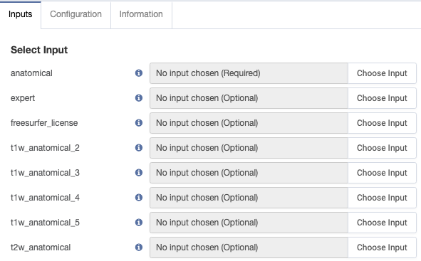

# freesurfer-recon-all
Gear that runs FreeSurfer [v7.1.1 Release (July 27, 2020)](https://surfer.nmr.mgh.harvard.edu/fswiki/ReleaseNotes) based on the official FS docker container.

To run this gear you need to select structural MRI file(s) as inputs and set configuration parameters.  Minimally, the "anatomical" input file and a Freesurfer license need to be provided.

Note: the current version of Freesurfer has an known issue with using the `-parallel` flag.  Contrary to what is said below, the default is to run with the flag off.

# Inputs

### anatomical (required)

Anatomical NIfTI file, DICOM archive, or previous freesurfer-recon-all zip archive. NOTE: A freesurfer-recon-all Gear output can be used provided the filename is preserved from its initial output (e.g., freesurfer-recon-all_<subject_code>*.zip)

### freesurfer_license (optional)
A license is required for this gear to run but it does not have to be provided as an input file.
There are [three ways](https://docs.flywheel.io/hc/en-us/articles/360013235453-How-to-include-a-Freesurfer-license-file-in-order-to-run-the-fMRIPrep-gear-) to provide the license to this gear.
[Obtaining a license is free](https://surfer.nmr.mgh.harvard.edu/registration.html).
If you select a file here, it will by copied into the $FSHOME directory when the gear runs before launching recon-all.

### t1w_anatomical_2 .. t1w_anatomical_5 (optional)
Additional anatomical NIfTI files.  These will be averaged together to provide for better motion correction.

### t2w_anatomical (optional)

T2 or FLAIR data to improve pial surfaces.  This can be NIfTI or DICOM.  The `-T2pial` or `-FLAIRpial` flags will need to be added in the `reconall_options` configuration parameter (see below).

# Configuration Options
Note: arguments that start with "gear-" are not passed to recon-all.  They control pre- or post-processing operations.

### gear-brainstem_structures (optional)

Generate an automated segmentation of four different brainstem structures from the input T1 scan: medulla oblongata, pons, midbrain and superior cerebellar peduncle (SCP).

### gear-convert_stats (optional)

Convert FreeSurfer stats files to CSV. (Default=true). Converts a subcortical stats file created by recon-all and/or mri_segstats (eg, aseg.stats) into a table in which each line is a subject and each column is a segmentation. The values are the volume of the segmentation in mm3 or the mean intensity over the structure. Also Converts a cortical stats file created by recon-all and or mris_anatomical_stats (eg, ?h.aparc.stats) into a table in which each line is a subject and each column is a parcellation. By default, the values are the area of the parcellation in mm2.

### gear-convert_surfaces (optional)

Convert selected surfaces in subject/surf to obj in output.

### gear-convert_volumes (optional)

Convert selected FreeSurfer volume files (mgz) to NIfTI format. (Default=true)

### gear-dry-run (optional)
Do everything except actually execute recon-all.  This useful for debugging.

### gear-FREESURFER_LICENSE (optional)
Text from license file generated during FreeSurfer registration.
Copy the contents of the license file and paste it into this argument.

#### gear-hippocampal_subfields (optional)

Generates an automated segmentation of the hippocampal subfields based on a statistical atlas built primarily upon ultra-high resolution (~0.1 mm isotropic) ex vivo MRI data. Choosing this option will write <subject_id>_HippocampalSubfields.csv to the final results. See: https://surfer.nmr.mgh.harvard.edu/fswiki/HippocampalSubfields for more info. (Default=true)

### gear-log-level (optional)
Gear Log verbosity level (ERROR|WARNING|INFO|DEBUG)

### gear-register_surfaces (optional)

Runs the xhemireg and surfreg scripts on your subject after having run recon-all in order to register the subject's left and inverted-right hemispheres to the fsaverage_sym subject. (The fsaverage_sym subject is a version of the fsaverage subject with a single the left-right symmetric pseudo-hemisphere.) (Default=true).

### n_cpus (optional)
Number of CPUs/cores use.  The default is to use all available cores.

### parallel (optional)

Command line option to run recon-all in parallel. (Default=False). By default, it instructs the binaries to use 4 processors (cores), meaning, 4 threads will run in parallel in some operations. Adjust n_cpus for more (or less) than 4 cores.

### reconall_options (required)

Command line options to the recon-all algorithm. (Default='-all -qcache'). By default we enable '-all' and '-qcache'. '-all' runs the entire pipeline and '-qcache' will resample data onto the average subject (called fsaverage) and smooth it at various FWHM (full-width/half-max) values, usually 0, 5, 10, 15, 20, and 25mm, which can speed later processing. Note that modification of these options may result in failure if the options are not recognized.

### subject_id

Desired subject ID. Any spaces in the subject_id will be replaced with underscores and will be used to name the resulting FreeSurfer output directory. NOTE: If using a previous Gear output as input the subject code will be parsed from the input archive, however it should still be provided here for good measure.

# Workflow
This gear runs recon-all on the provided inputs with the given configuration options.

# Outputs
All files that are the results of recon-all in the Freesurfer subject directory are compressed into a single zip archive.

This gear was created using the [bdis-app-template](https://github.com/flywheel-apps/bids-app-template).  For documentation on how to run the tests in this gear, please see that README file.
